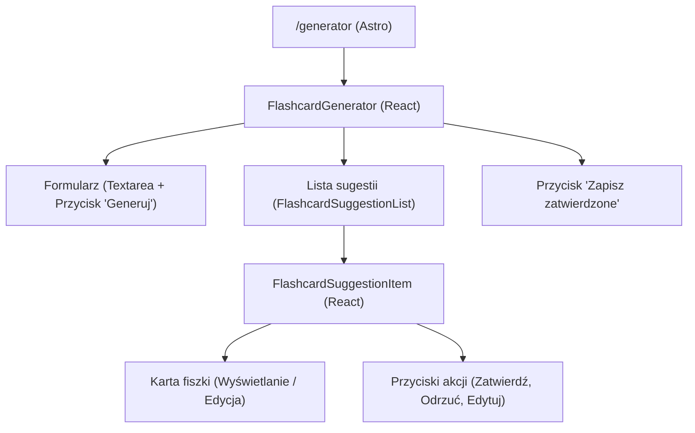

# Plan implementacji widoku – Generator Fiszek

## 1. Przegląd

Widok "Generator Fiszek" umożliwia użytkownikom automatyczne tworzenie fiszek na podstawie dostarczonego tekstu. Użytkownik wkleja tekst, system wysyła go do usługi AI, a następnie wyświetla listę sugerowanych fiszek. Użytkownik może przeglądać, edytować, akceptować lub odrzucać sugestie, a na koniec zapisać wybrane fiszki w swojej kolekcji.

## 2. Routing widoku

- **Ścieżka:** `/generator`
- **Plik:** `src/pages/generator.astro`

## 3. Struktura komponentów

Struktura będzie oparta o architekturę "wyspową" (Astro Islands). Główna strona Astro będzie renderować interaktywny komponent React, który zarządza całą logiką.

## 4. Szczegóły komponentów

### `FlashcardGenerator` (React)

Główny komponent-kontener dla widoku generatora.

- **Opis:** Zarządza stanem całego procesu: treścią pola tekstowego, listą sugestii, statusami ładowania i błędów. Komunikuje się z API w celu generowania i zapisywania fiszek.
- **Główne elementy:**
    - `Textarea` (Shadcn/ui) do wprowadzania tekstu.
    - `Button` (Shadcn/ui) do uruchomienia generowania.
    - Komponent `FlashcardSuggestionList` do wyświetlania sugestii.
    - `Button` do zapisywania zatwierdzonych fiszek.
    - Wskaźniki ładowania (np. `Skeleton` z Shadcn/ui) i komunikaty o błędach (np. `Alert`).
- **Obsługiwane interakcje:**
    - Wprowadzanie tekstu.
    - Kliknięcie przycisku "Generuj fiszki".
    - Kliknięcie przycisku "Zapisz zatwierdzone".
    - Odbieranie zdarzeń od komponentów dzieci (aktualizacja statusu sugestii).
- **Warunki walidacji:**
    - Pole tekstowe musi zawierać od 1000 do 10000 znaków, aby przycisk "Generuj fiszki" był aktywny.
    - Przycisk "Zapisz zatwierdzone" jest aktywny tylko wtedy, gdy co najmniej jedna sugestia ma status `approved`.
- **Typy:** `SuggestionViewModel`, `FlashcardGenerateCommand`, `FlashcardCreateCommand`.
- **Propsy:** Brak (komponent jest kontenerem stanu).

### `FlashcardSuggestionList` (React)

Komponent do renderowania listy sugestii.

- **Opis:** Otrzymuje listę sugestii i renderuje dla każdej z nich komponent `FlashcardSuggestionItem`.
- **Główne elementy:** Elastyczny kontener (np. `div` ze stylami flexbox/grid) mapujący tablicę sugestii.
- **Obsługiwane interakcje:** Brak bezpośrednich interakcji, deleguje je do dzieci.
- **Typy:** `SuggestionViewModel[]`.
- **Propsy:**
    - `suggestions: SuggestionViewModel[]`
    - `onSuggestionUpdate: (id: string, updatedData: { przod: string; tyl: string }) => void`
    - `onSuggestionStatusChange: (id: string, status: 'approved' | 'rejected' | 'pending') => void`

### `FlashcardSuggestionItem` (React)

Komponent reprezentujący pojedynczą sugestię fiszki.

- **Opis:** Wyświetla przód i tył fiszki oraz przyciski akcji. Posiada dwa tryby: wyświetlania i edycji.
- **Główne elementy:**
    - `Card` (Shadcn/ui) jako kontener.
    - Pola tekstowe (`p`, `div`) do wyświetlania treści.
    - `Textarea` do edycji `przodu` i `tyłu` w trybie edycji.
    - `Button` dla akcji: "Zatwierdź", "Odrzuć", "Edytuj", "Zapisz zmiany", "Anuluj".
- **Obsługiwane interakcje:**
    - Zatwierdzenie sugestii.
    - Odrzucenie sugestii.
    - Włączenie trybu edycji.
    - Zapisanie zmian po edycji.
    - Anulowanie edycji.
- **Warunki walidacji:** Brak.
- **Typy:** `SuggestionViewModel`.
- **Propsy:**
    - `suggestion: SuggestionViewModel`
    - `onUpdate: (id: string, updatedData: { przod: string; tyl: string }) => void`
    - `onStatusChange: (id: string, status: 'approved' | 'rejected' | 'pending') => void`

## 5. Typy

### `SuggestionViewModel` (Typ kliencki)

Reprezentuje sugestię fiszki w interfejsie użytkownika, rozszerzając dane z API o stan potrzebny na froncie.

- **`id: string`**: Unikalny identyfikator generowany po stronie klienta (np. za pomocą `crypto.randomUUID()`), niezbędny dla kluczy w React i zarządzania stanem.
- **`przod: string`**: Przód fiszki.
- **`tyl: string`**: Tył fiszki.
- **`status: 'pending' | 'approved' | 'rejected'`**: Status sugestii, zarządzany przez interakcję użytkownika. Domyślnie: `'pending'`.

## 6. Zarządzanie stanem

Zalecane jest stworzenie customowego hooka `useFlashcardGenerator`, który zamknie w sobie całą logikę stanu i interakcji z API.

### `useFlashcardGenerator`

- **Cel:** Abstrahuje logikę komponentu `FlashcardGenerator`, czyniąc go czystszym.
- **Zarządzany stan:**
    - `suggestions: SuggestionViewModel[]`: Lista sugestii.
    - `status: 'idle' | 'loading' | 'saving' | 'success' | 'error'`: Ogólny status procesu.
    - `error: string | null`: Komunikat o błędzie.
- **Udostępniane funkcje:**
    - `generateFlashcards(text: string)`: Wysyła żądanie do API `/generate`.
    - `updateSuggestion(id: string, data: { przod: string, tyl: string })`: Aktualizuje treść sugestii.
    - `changeSuggestionStatus(id: string, status: SuggestionViewModel['status'])`: Zmienia status sugestii.
    - `saveApprovedFlashcards()`: Filtruje zatwierdzone sugestie i wysyła je do API w celu zapisu.

## 7. Integracja API

### Generowanie sugestii
- **Endpoint:** `POST /api/flashcards/generate`
- **Typ żądania:** `FlashcardGenerateCommand` (`{ text: string }`)
- **Typ odpowiedzi (sukces):** `FlashcardGenerateResponseDTO` (`{ suggestions: { przod: string, tyl: string }[] }`)
- **Przepływ:** Po otrzymaniu odpowiedzi, każda sugestia jest mapowana na `SuggestionViewModel` z unikalnym `id` i statusem `'pending'`.

### Zapisywanie fiszek
- **Endpoint:** `POST /api/flashcards`
- **Typ żądania:** `FlashcardCreateCommand` (`{ flashcards: FlashcardCreateInput[] }`)
- **Typ `FlashcardCreateInput`:** `{ przod: string, tyl: string, status: 'zatwierdzona' }`
- **Przepływ:** Przed wysłaniem żądania, stan `suggestions` jest filtrowany w poszukiwaniu fiszek ze statusem `'approved'`. Następnie są one mapowane na format `FlashcardCreateInput`.

## 8. Interakcje użytkownika

- **Wprowadzanie tekstu:** Użytkownik wpisuje tekst w `Textarea`. Interfejs na bieżąco wyświetla liczbę znaków.
- **Generowanie fiszek:** Po kliknięciu "Generuj fiszki", interfejs przechodzi w stan ładowania (np. pokazuje komponenty `Skeleton`), a po zakończeniu wyświetla listę sugestii lub komunikat o błędzie.
- **Akcje na sugestii:**
    - **Zatwierdź:** Karta sugestii zmienia wygląd (np. zielone tło), a jej status w stanie aplikacji zmienia się na `approved`.
    - **Odrzuć:** Karta jest wizualnie "dezaktywowana" (np. wyszarzona), a jej status zmienia się na `rejected`.
    - **Edytuj:** Pola tekstowe na karcie stają się edytowalne.
- **Zapisywanie:** Kliknięcie "Zapisz zatwierdzone" wysyła żądanie do API, pokazuje wskaźnik ładowania, a po sukcesie czyści listę sugestii i wyświetla powiadomienie o powodzeniu.

## 9. Warunki i walidacja

- **Walidacja długości tekstu:**
    - **Komponent:** `FlashcardGenerator`
    - **Warunek:** `text.length >= 1000 && text.length <= 10000`
    - **Efekt:** Przycisk "Generuj fiszki" jest aktywny/nieaktywny. Pod polem tekstowym wyświetlana jest informacja pomocnicza (np. "Wymagane 1000-10000 znaków").
- **Walidacja przed zapisem:**
    - **Komponent:** `FlashcardGenerator`
    - **Warunek:** `suggestions.some(s => s.status === 'approved')`
    - **Efekt:** Przycisk "Zapisz zatwierdzone" jest aktywny/nieaktywny.

## 10. Obsługa błędów

- **Błąd generowania (np. problem z siecią, błąd serwera 5xx):** W widoku wyświetlany jest komponent `Alert` lub `Toast` z komunikatem, np. "Wystąpił błąd podczas generowania fiszek. Spróbuj ponownie."
- **Brak sugestii:** Jeśli API zwróci pustą tablicę, na liście pojawia się komunikat, np. "Nie znaleziono propozycji dla podanego tekstu. Spróbuj go zmodyfikować."
- **Błąd zapisu:** W przypadku niepowodzenia zapisu zatwierdzonych fiszek, wyświetlany jest `Toast` z komunikatem, np. "Nie udało się zapisać fiszek. Sprawdź połączenie i spróbuj ponownie."

## 11. Kroki implementacji

1.  **Utworzenie pliku strony:** Stwórz plik `src/pages/generator.astro`.
2.  **Stworzenie głównego komponentu:** Stwórz plik `src/components/FlashcardGenerator.tsx` i umieść go na stronie Astro z dyrektywą `client:load`.
3.  **Implementacja formularza:** W `FlashcardGenerator` dodaj `Textarea` i `Button` z Shadcn/ui. Zaimplementuj logikę walidacji długości tekstu i stanu przycisku.
4.  **Stworzenie komponentów listy:** Stwórz komponenty `FlashcardSuggestionList.tsx` i `FlashcardSuggestionItem.tsx`.
5.  **Implementacja stanu:** Stwórz i zintegruj customowy hook `useFlashcardGenerator` do zarządzania stanem, w tym listą `SuggestionViewModel`.
6.  **Integracja API generowania:** Zaimplementuj w hooku funkcję `generateFlashcards`, która wywołuje `POST /api/flashcards/generate`, obsługuje stany ładowania i błędu oraz mapuje odpowiedź na `SuggestionViewModel[]`.
7.  **Implementacja akcji na sugestiach:** Połącz przyciski w `FlashcardSuggestionItem` z funkcjami `changeSuggestionStatus` i `updateSuggestion` z hooka. Zaimplementuj logikę trybu edycji wewnątrz `FlashcardSuggestionItem`.
8.  **Integracja API zapisu:** Zaimplementuj funkcję `saveApprovedFlashcards`, która filtruje sugestie i wysyła je do `POST /api/flashcards`.
9.  **UI/UX:** Dodaj wskaźniki ładowania (`Skeleton`), powiadomienia (`Toast`) i komunikaty o błędach (`Alert`), aby zapewnić płynne doświadczenie użytkownika.
10. **Testowanie:** Przetestuj cały przepływ: wprowadzanie tekstu, generowanie, różne akcje na sugestiach, zapisywanie oraz obsługę przypadków brzegowych i błędów. 